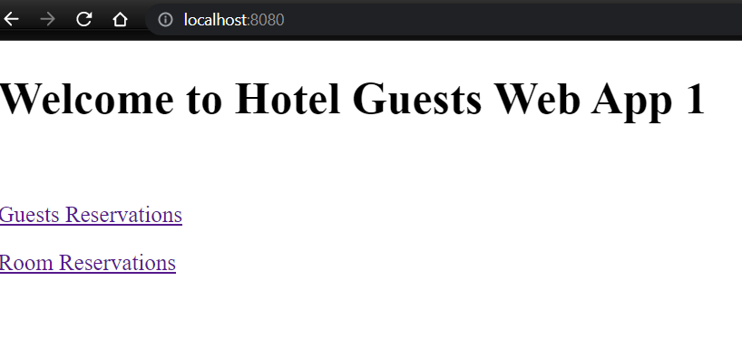

# hotel-guests
# http://localhost:8080/

# RESTful Endpoints
- GET http://localhost:8080/api/reservations
- GET http://localhost:8080/api/guests
- GET http://localhost:8080/api/rooms
- POST http://localhost:8080/api/guests
- 

# CLI: git new branch
- git checkout -b "new-branch"
- git push --set-upstream origin new-branch

# CLI: git merge
- git checkout main
- git merge new-branch
- git push
